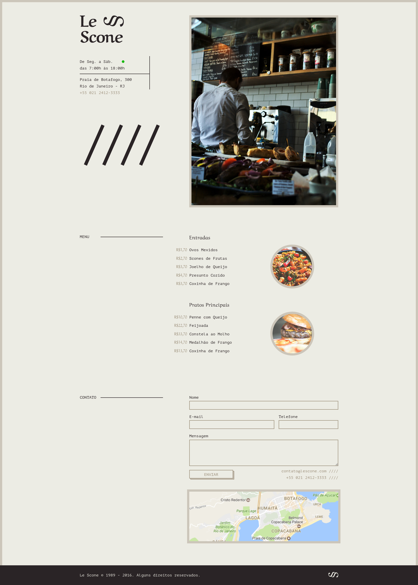

# Le Scone

A restaurant webpage implemented with HTML and Sass as part of the [Sass course](https://www.origamid.com/curso/css-com-sass/) from [Origamid](https://www.origamid.com).

<details>
<summary>To-do</summary>

   - [x] Initialize npm
   - [ ] Set up a workflow automation with Gulp
      - [x] Install and configure a Sass linter
      - [x] Compile Sass and minify the CSS output
      - [x] Set up Browser-sync and file watching
      - [ ] Optimize images
   - [ ] Separate source from build files (```/src``` and ```/dist``` folders) 
   - [ ] Rewrite stylesheets using BEM methodology
   - [ ] Update README
</details>

[Live Demo](https://guilhermeomt.github.io/le-scone)

[
](https://guilhermeomt.github.io/le-scone)
